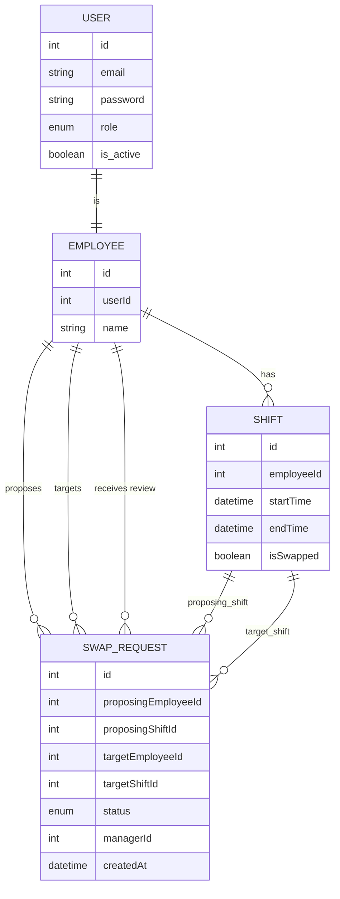

# RO Interview - Employee Shift Swap System

A robust NestJS-based API for managing employee shift swaps, built with a focus on clean architecture, idempotency, and event-driven status tracking.

## 1. System Overview

The system facilitates a secure and fair process for employees to exchange work shifts.

- **Propose Swap**: Employees can request to swap one of their shifts with a shift from another employee.
- **Respond to Swap**: The target employee can accept or reject the proposal.
- **Manager Review**: All accepted swaps must be reviewed and approved by an assigned manager before the shifts are officially swapped.
- **Idempotency**: The system handles duplicate or redundant actions (e.g., re-accepting an already accepted swap) safely, ensuring only one valid state transition occurs while providing clear feedback.
- **Lazy Expiration**: Expired swap requests (not acted upon within 24 hours) are automatically cleaned up when the list is fetched.
- **Event-Driven**: Emits events for every swap status change, allowing for easy integration with notification systems.

## 2. Architecture Decisions

- **Modular Design**: Organized into cohesive modules (`Auth`, `Users`, `Employees`) for maintainability.
- **Service Specialization (SRP)**: The original monolithic `EmployeesService` was refactored into specialized services:
  - `SwapRequestsService`: Handles the complex lifecycle of a swap Request.
  - `ShiftsService`: Manages shift-specific operations.
- **Repository Pattern**: Abstract Base Repository provides a consistent interface for database operations, decoupling the domain logic from TypeORM.
- **Transactional Integrity**: Critical operations (like marking two shifts as swapped simultaneously) are wrapped in custom `@Transactional` decorators to ensure data consistency.
- **Idempotent Actions**: Instead of allowing inconsistent state transitions, the system validates the current state of a swap request before every action. This ensures that redundant or late actions do NOT impact the system's integrity and return meaningful error messages. This results in a robust API that is easy to integrate with.
- **Simplified Expiration**: Chose a "lazy cleanup" approach for swap expiration to avoid the overhead of cron jobs in a demonstration environment, keeping the system lightweight and easy to deploy.

## 3. ERD (Entity Relationship Diagram)



## 4. How to Run

### Prerequisites
- Node.js (v18+)
- PostgreSQL

### Setup

1. **Install Dependencies**:
   ```bash
   npm install
   ```

2. **Configure Environment**:
   Create a `.env` file in the root directory (refer to `.env` for required variables):
   ```env
   DB_HOST=localhost
   DB_PORT=5432
   DB_NAME=interview-demo
   DB_USER=postgres
   DB_PASSWORD=your_password
   PORT=3001
   JWT_SECRET_KEY=your_secret
   JWT_EXPIRES_IN=1d
   ```

3. **Run Migrations** (Optional - if using a fresh DB):
   ```bash
   npm run migration:run
   ```

4. **Start the Application**:
   ```bash
   # Development mode
   npm run start:dev
   ```

### API Documentation
Once the server is running, access the Swagger UI at:
`http://localhost:3001/api-docs`

## Features Added During Development

- [x] Refactored `EmployeesService` into specialized services.
- [x] Implemented `@Transactional` for swap operations.
- [x] Added `isSwapped` flag to shifts.
- [x] Implemented lazy cleanup for expired swaps.
- [x] Integrated NestJS `EventEmitter` for status change tracking.
- [x] Established one-to-one relationship between `User` and `Employee`.
